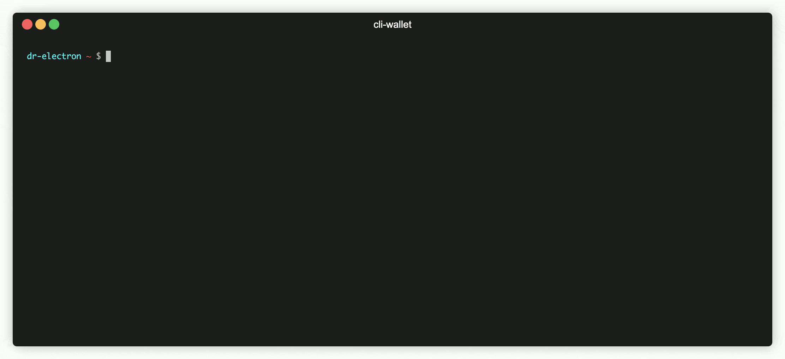

> **Warning**
> Deprecated - The cli-wallet has been moved to https://github.com/iotaledger/iota-sdk

# IOTA Stardust CLI Wallet



Command line interface application for the [IOTA wallet library](https://github.com/iotaledger/wallet.rs).

## Usage

After downloading the CLI, initialize the signer for the wallet. On Mac and Linux you will first need to `chmod +x ./wallet`.

```
./wallet init --node http://node.url:port --mnemonic MNEMONIC
// Example:
./wallet init --node "http://localhost:14265" --mnemonic "giant dynamic museum toddler six deny defense ostrich bomb access mercy
blood explain muscle shoot shallow glad autumn author calm heavy hawk abuse rally"
```

Then create a new account

```
./wallet new ALIAS
// Example:
./wallet new Alice
```

If you already created an account, you can just run the CLI without args to get to the account selector:

```
./wallet
```

Alternatively, you can select an existing account by it's alias, to use with the `account` command:

```
./wallet account Alice
```

## Commands

To see the full list of available commands look at the documentation [here](./documentation/docs).

## Caveats

### Database path

By default the database path is `./wallet-cli-database` but you can change this with the `WALLET_DATABASE_PATH` environment variable:

```
export WALLET_DATABASE_PATH=/path/to/database # or add it to your .bashrc, .zshrc
./wallet [COMMAND] [OPTIONS]
```

## Contributing

To run the CLI from source, install Rust (usually through [Rustup](https://rustup.rs/)) and run the following commands:

```
git clone https://github.com/iotaledger/wallet.rs
cd cli
cargo run -- [COMMAND] [OPTIONS]
```
