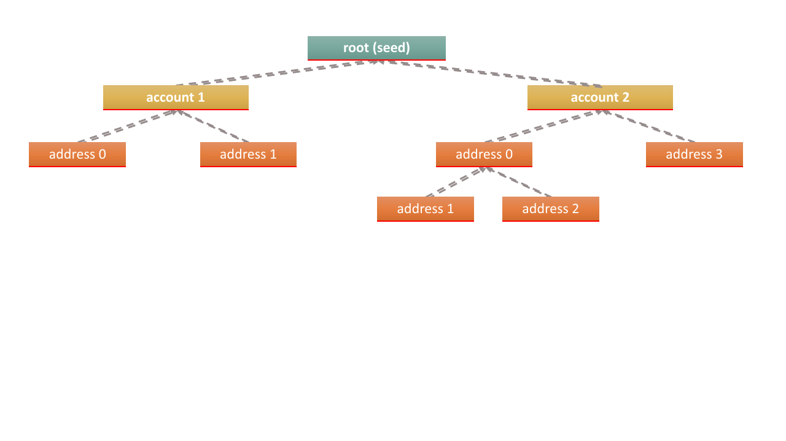

# IOTA Wallet Libraries

There are currently available the following official bindings to `wallet.rs`:
- [Rust](./rust/) 
- [Node.js](./nodejs/) 
- [Python](./python/)

## Getting Started
It is a recommended approach to start your interactions with IOTA on a `testnet` network. The official libraries incorporate an automatic node discovery mechanism and so endpoint API is not important to get you started. 

Network explorer is available at [IOTA Tangle Explorer](https://explorer.iota.org/chrysalis).

In order to properly test value-based transactions on testnet network, you are going to need some tokens! You can get some testnet tokens using the [faucet](https://faucet.testnet.chrysalis2.com/).

## `Wallet.rs` in a nutshell
In the `wallet.rs`, we use an account model, so you can create an account for each of your users. The other approach would be to use one account and generate many addresses, which you can link to your users in your database. The library allows users to assign a meaningful alias to each account. It also leaves the choice to users if they want to segregate their funds across multiple accounts or multiple addresses.

The library supports derivation for multiple accounts from a single seed. An account is simply a deterministic identifier from which multiple addresses can be further derived. The following illustrates the relationships between seed, accounts and addresses.

